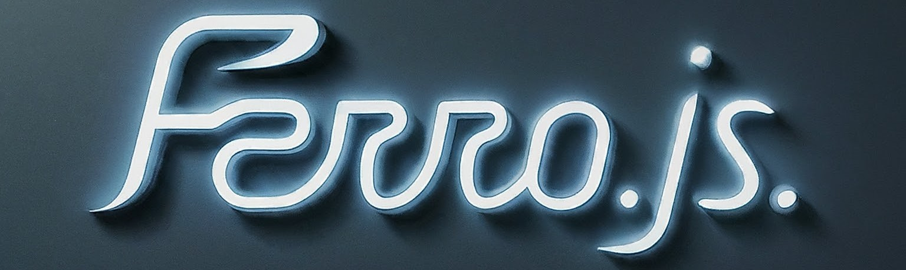

---
# Ferro.js



Ferro.js is a JavaScript library for adding interactive animations and effects to web elements using GSAP (GreenSock Animation Platform). This library includes various functions to create engaging animations and effects such as card reveals, text animations, parallax images, and more. Below are the detailed instructions and options for using each function.

---

## Getting Started

To use the animation effects provided by `Ferro.js` and `Ferro.css`, follow the steps below:

### 1. Include GSAP and ScrollTrigger

Include the GSAP library and the ScrollTrigger plugin in your HTML file. These are required for the animations to work.

```html
  <!-- GSAP Library -->
  <script src="https://cdnjs.cloudflare.com/ajax/libs/gsap/3.12.5/gsap.min.js"
          integrity="sha512-7eHRwcbYkK4d9g/6tD/mhkf++eoTHwpNM9woBxtPUBWm67zeAfFC+HrdoE2GanKeocly/VxeLvIqwvCdk7qScg=="
          crossorigin="anonymous" referrerpolicy="no-referrer"></script>
  <!-- GSAP ScrollTrigger Plugin -->
  <script src="https://cdnjs.cloudflare.com/ajax/libs/gsap/3.12.5/ScrollTrigger.min.js"
          integrity="sha512-onMTRKJBKz8M1TnqqDuGBlowlH0ohFzMXYRNebz+yOcc5TQr/zAKsthzhuv0hiyUKEiQEQXEynnXCvNTOk50dg=="
          crossorigin="anonymous" referrerpolicy="no-referrer"></script>
```

### 2. Add Ferro.css and Ferro.js

Include the `Ferro.css` and `Ferro.js` files using the following CDN links in your HTML file:

```html
  <!-- Ferro.css -->
  <link rel="stylesheet" href="https://cdn.jsdelivr.net/gh/atharvabaodhankar/ferro.js@master/ferro.css">
  
  <!-- Ferro.js -->
  <script src="https://cdn.jsdelivr.net/gh/atharvabaodhankar/ferro.js@master/ferro.js"></script>
```

---


### 3. Using the Effects

You can now use the various effects provided by `Ferro.js` by calling the respective methods on your elements.

---

## Ferro Functions


## Heading Effect

The `headingEffect` function applies animated effects to headings on your webpage using GSAP (GreenSock Animation Platform) and ScrollTrigger. This function divides the text content of the selected headings into individual characters and animates them based on the specified style.

### Parameters

- **`selector`** (string): A CSS selector to target the heading elements.
- **`style`** (number, optional): Determines the type of animation applied. The default value is `0`. Styles are as follows:
  - `1`: Bounce and rotation effect.
  - `2`: Scaling and translation effect.
  - `3`: Skew and translation effect.
  - `4`: Bounce effect.
  - `5`: Elastic effect.
  - `6`: Power4 easing effect.
  - `7`: Elastic effect with increased duration.
  - `8`: RotationY effect.
  - `9`: Scaling effect with back easing.
  - `10`: Combined translation effect with circ easing.

### Usage

```javascript
Ferro.headingEffect(".h1", 7);
```

This will apply the effect with `style` 7 (elastic animation) to all elements matching the `.h1` selector.

### Example

To apply an elastic effect to all headings with the class `.h1`, you would use:

```javascript
Ferro.headingEffect(".h1", 7);
```

This will animate each character of the heading as the user scrolls, creating a dynamic and engaging visual effect.


## Card Show Effect

Creates an animated reveal effect for card elements.

#### Usage
```javascript
Ferro.cardShow(selector, style, srb, st, ed);
```

#### Parameters
- `selector` (string): CSS selector for the card elements to animate.
- `style` (number, optional): Animation style (0 to 8). Default is 0.
- `srb` (boolean, optional): If true, enables ScrollTrigger for the animation. Default is false.
- `st` (string, optional): Scroll start position (e.g., "top"). Default is "top".
- `ed` (string, optional): Scroll end position (e.g., "70%"). Default is "70%".

#### Example
```javascript
Ferro.cardShow('.card', 3);
```
## Button Hover

The `button` function adds a smooth animation effect to buttons on your webpage. It utilizes a custom CSS transition to create a visually appealing animation when the button is hovered over or clicked.

### Parameters

- **`selector`** (string): A CSS selector to target the button elements.
- **`time`** (number, optional): The duration of the animation in seconds. The default value is `0.5`.
- **`easing`** (string, optional): The easing function for the animation. The default value is `"cubic-bezier(0.68, -0.55, 0.265, 1.55)"`.

### Usage

```javascript
Ferro.button(".btn", 0.5, "ease");
```

This will apply the animation effect to all buttons with the class `.btn` with a duration of `0.5` seconds and the `ease` easing function.

### Example

To apply a custom button animation effect to all buttons with the class `.btn`, you would use:

```javascript
Ferro.button(".btn", 0.5, "ease");
```

This will apply the animation effect with a duration of `0.5` seconds and the `ease` easing function to all elements matching the `.btn` selector.


## Text Underline Effect

Adds a customizable underline effect to text elements.

#### Usage
```javascript
Ferro.textUnderline(buttons, cl, height);
```

#### Parameters
- `buttons` (string): CSS selector for the text elements to which the underline effect will be applied.
- `cl` (string, optional): Color of the underline. Default is "#000".
- `height` (string, optional): Height of the underline. Default is "3px".

#### Example
```javascript
Ferro.textUnderline(".btn", "green", "5px");
```

## Elastic Image Effect

Creates an elastic animation effect on images when they enter the viewport.

#### Usage
```javascript
Ferro.elasticImg(element, style);
```

#### Parameters
- `element` (string): CSS selector for the image element.
- `style` (number, optional): Style of the animation (0 for height, 1 for width, 2 for both). Default is 0.

#### Example
```javascript
Ferro.elasticImg(".box", 2);
```

## Parallax Image Effect

Creates a parallax shift effect on images.

#### Usage
```javascript
Ferro.imgShift(element, eff);
```

#### Parameters
- `element` (string): CSS selector for the element containing the image.
- `eff` (number, optional): Amount of vertical shift (in vh). Default is 10.

#### Example
```javascript
Ferro.imgShift(".box", 20);
```

## Ferro Dynamic Hover

The `dynamicHover` function will create a dynamic hover effect where the elements smoothly follow the mouse cursor, enhancing the visual interaction on your webpage.

### Parameters

- **`selector`** (string): A CSS selector to target the elements for the hover effect.
- **`speed`** (number, optional): Determines the sensitivity of the hover effect. The default value is `0`. Sensitivity levels are as follows:
  - `1`: Sensitivity level 10
  - `2`: Sensitivity level 12
  - `3`: Sensitivity level 14
  - `4`: Sensitivity level 15
  - `5`: Sensitivity level 16
  - `default`: Sensitivity level 8

### Usage

```javascript
Ferro.dynamicHover(".box", 3);
```

This will apply the hover effect with sensitivity level 3 to all elements matching the `.box` selector.

### Example

To apply the hover effect to all elements with the class `.box` and set the sensitivity to level 3, you would use:

```javascript
Ferro.dynamicHover(".box", 3);
```


## Text Waves Effect

Creates a wave effect on text with customizable colors for the outline and fill.

#### Usage
```javascript
Ferro.textWaves(selector, txt, color1, color2);
```

#### Parameters
- `selector` (string): CSS selector for the element to which the wave effect will be applied.
- `txt` (string): Text to display.
- `color1` (string, optional): Color for the text outline. Default is "#fff".
- `color2` (string, optional): Color for the text fill. Default is the same as `color1`.

#### Example
```javascript
Ferro.textWaves(".box1", "Ferro.js", "#000", "#fff");
```

## Text Split Effect

Splits text into words and animates them with various effects when they enter the viewport.

#### Usage
```javascript
Ferro.textSplit(selector, scrub, style, st, ed);
```

#### Parameters
- `selector` (string): CSS selector for the text elements.
- `scrub` (boolean, optional): If true, enables ScrollTrigger for the animation. Default is false.
- `style` (number, optional): Style of the animation (0 to 4). Default is 0.
- `st` (string, optional): Scroll start position (e.g., "top"). Default is "top".
- `ed` (string, optional): Scroll end position (e.g., "70%"). Default is "70%".

#### Example
```javascript
Ferro.textSplit(".text", 1, 4, "0%", "5%");
```

## Magnet Effect

Creates a magnetic cursor effect on specified elements.

#### Usage
```javascript
Ferro.magnet(selector, sensitivity);
```

#### Parameters
- `selector` (string): CSS selector for the elements to apply the magnetic effect.
- `sensitivity` (number): Sensitivity level (1 to 5).

#### Example
```javascript
Ferro.magnet(".ferro-magnet", 3);
```


## Mouse Follower

Creates a custom mouse follower element.

#### Usage
```javascript
Ferro.mouseFollower(sp, size, blendMode, selectors, se);
```

#### Parameters
- `sp` (number, optional): Speed of the follower (0 to 5). Default is 0.
- `size` (string, optional): Size of the follower ball (e.g., "15px"). Default is "15px".
- `blendMode` (boolean, optional): If true, enables mix-blend-mode. Default is true.
- `selectors` (array, optional): Array of CSS selectors. When the mouse hovers over elements matching these selectors, the follower ball scales to cover the element.
- `se` (number, optional): Scale enhancer (0 to 5). Adjusts the scaling of the follower ball based on a defined enhancement value. Default is 0.

#### Example
```javascript
Ferro.mouseFollower(1, "20px", true, ['h1', '.hover-elements'], 3);
```

This example creates a custom mouse follower with the following settings:
- Speed: 1
- Size: 20px
- Mix-blend-mode enabled
- Scale enhancer: 3
- The follower ball will scale to cover any `h1` element or elements with the class `.hover-scale` when hovered.


## Additional Notes

- Ensure GSAP is included in your project for Ferro.js to work correctly.
- Customize the CSS styles as needed to match your design requirements.


---
