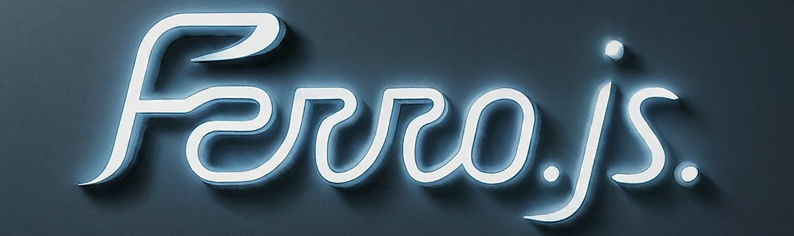

# Ferro.js 🚀


A professional animation library built on GSAP for creating engaging web interactions.

## Features

- 🎨 10+ Ready-to-use animations
- 🎯 Easy to implement
- ⚡ Optimized performance
- 📱 Mobile-friendly
- 🛠 Highly customizable

## Installation

### Using NPM
```bash
npm install ferro-js gsap
```

### Using Yarn
```bash
yarn add ferro-js gsap
```

## Usage

### Method 1: ES6 Modules (Recommended)
```javascript
import Ferro from 'ferro-js';
import 'ferro-js/dist/ferro.min.css';

// Initialize animations
Ferro.cardShow('.card', 3);
Ferro.magnet('.button', 3);
```

### Method 2: CommonJS
```javascript
const Ferro = require('ferro-js');
require('ferro-js/dist/ferro.min.css');

// Initialize animations
Ferro.cardShow('.card', 3);
```

### Method 3: CDN
```html
<!-- Include GSAP -->
<script src="https://cdnjs.cloudflare.com/ajax/libs/gsap/3.12.5/gsap.min.js"></script>
<script src="https://cdnjs.cloudflare.com/ajax/libs/gsap/3.12.5/ScrollTrigger.min.js"></script>

<!-- Include Ferro -->
<script src="https://unpkg.com/ferro-js@latest/dist/ferro.min.js"></script>
<link rel="stylesheet" href="https://unpkg.com/ferro-js@latest/dist/ferro.min.css">
```

## Framework Integration

### React
```jsx
import { useEffect } from 'react';
import Ferro from 'ferro-js';
import 'ferro-js/dist/ferro.min.css';

function App() {
  useEffect(() => {
    // Initialize animations after component mount
    Ferro.cardShow('.card', 3);
    Ferro.magnet('.button', 3);
  }, []);

  return (
    <div>
      <div className="card">Card content</div>
      <button className="button">Magnetic Button</button>
    </div>
  );
}
```

### Vue
```vue
<template>
  <div>
    <div class="card">Card content</div>
    <button class="button">Magnetic Button</button>
  </div>
</template>

<script>
import Ferro from 'ferro-js';
import 'ferro-js/dist/ferro.min.css';

export default {
  mounted() {
    // Initialize animations after component mount
    Ferro.cardShow('.card', 3);
    Ferro.magnet('.button', 3);
  }
}
</script>
```

### Next.js
```javascript
// pages/_app.js
import 'ferro-js/dist/ferro.min.css';

// components/AnimatedComponent.js
import { useEffect } from 'react';
import dynamic from 'next/dynamic';

// Import Ferro dynamically to avoid SSR issues
const Ferro = dynamic(() => import('ferro-js'), { ssr: false });

export default function AnimatedComponent() {
  useEffect(() => {
    // Initialize animations after component mount
    Ferro.cardShow('.card', 3);
    Ferro.magnet('.button', 3);
  }, []);

  return (
    // Your component JSX
  );
}
```

## Examples

### Card Show Animation
```javascript
// Basic usage
Ferro.cardShow('.card', 3);

// With scroll trigger
Ferro.cardShow('.card', 3, true, 'top', '70%');
```

### Magnetic Effect
```javascript
// Basic usage
Ferro.magnet('.button', 3);

// Multiple elements
Ferro.magnet('.magnetic-elements', 4);
```

### Text Wave Effect
```javascript
// Basic usage
Ferro.textWaves('.heading', 'Hello World');

// With custom colors
Ferro.textWaves('.heading', 'Hello World', '#000', '#fff');
```

### Button Animation Variations

The `Ferro.button` function now supports animation variations via the `variation` parameter:
- **1**: Vertical Slide (default)
- **2**: Fade & Tilt
- **3**: Gentle Rotate Slide
- **4**: Skew Slide
- **5**: Scale Pop
- **6**: 3D Flip

#### Usage
```javascript
// Vertical Slide (default)
Ferro.button('.btn-slide', 0.5, 'ease', 1);

// Fade & Tilt
Ferro.button('.btn-fade', 0.5, 'ease', 2);

// Gentle Rotate Slide
Ferro.button('.btn-circular', 0.5, 'ease', 3);

// Skew Slide
Ferro.button('.btn-skew', 0.5, 'ease', 4);

// Scale Pop
Ferro.button('.btn-scale', 0.5, 'ease', 5);

// 3D Flip
Ferro.button('.btn-flip', 0.5, 'ease', 6);
```

#### Example HTML
```html
<button class="btn btn-slide">Ferro Button</button>
<button class="btn btn-fade">Ferro Button</button>
<button class="btn btn-circular">Ferro Button</button>
<button class="btn btn-skew">Ferro Button</button>
<button class="btn btn-scale">Ferro Button</button>
<button class="btn btn-flip">Ferro Button</button>
```

#### Example Initialization
```javascript
Ferro.button('.btn-slide', 0.5, 'ease', 1); // Vertical Slide
Ferro.button('.btn-fade', 0.5, 'ease', 2);  // Fade & Tilt
Ferro.button('.btn-circular', 0.5, 'ease', 3); // Gentle Rotate Slide
Ferro.button('.btn-skew', 0.5, 'ease', 4); // Skew Slide
Ferro.button('.btn-scale', 0.5, 'ease', 5); // Scale Pop
Ferro.button('.btn-flip', 0.5, 'ease', 6); // 3D Flip
```

#### Parameters
- `selector` (string): CSS selector for the button elements.
- `time` (number, optional): Animation duration in seconds. Default is 0.5.
- `easing` (string, optional): Easing function. Default is 'cubic-bezier(0.68, -0.55, 0.265, 1.55)'.
- `variation` (number, optional): Animation style. 1 = Vertical Slide (default), 2 = Fade & Tilt, 3 = Gentle Rotate Slide, 4 = Skew Slide, 5 = Scale Pop, 6 = 3D Flip.

[View Full Documentation](https://ferro-js.com/docs)

## Browser Support

- Chrome (latest)
- Firefox (latest)
- Safari (latest)
- Edge (latest)

## Contributing

We welcome contributions! Please read our [contributing guidelines](CONTRIBUTING.md) first.

## License

MIT © Atharva Baodhankar 

---
# Ferro.js



Ferro.js is a JavaScript library for adding interactive animations and effects to web elements using GSAP (GreenSock Animation Platform). This library includes various functions to create engaging animations and effects such as card reveals, text animations, parallax images, and more. Below are the detailed instructions and options for using each function.

---

## Getting Started

To use the animation effects provided by `Ferro.js` and `Ferro.css`, follow the steps below:

### 1. Include GSAP and ScrollTrigger

Include the GSAP library and the ScrollTrigger plugin in your HTML file. These are required for the animations to work.

```html
  <!-- GSAP Library -->
  <script src="https://cdnjs.cloudflare.com/ajax/libs/gsap/3.12.5/gsap.min.js"
          integrity="sha512-7eHRwcbYkK4d9g/6tD/mhkf++eoTHwpNM9woBxtPUBWm67zeAfFC+HrdoE2GanKeocly/VxeLvIqwvCdk7qScg=="
          crossorigin="anonymous" referrerpolicy="no-referrer"></script>
  <!-- GSAP ScrollTrigger Plugin -->
  <script src="https://cdnjs.cloudflare.com/ajax/libs/gsap/3.12.5/ScrollTrigger.min.js"
          integrity="sha512-onMTRKJBKz8M1TnqqDuGBlowlH0ohFzMXYRNebz+yOcc5TQr/zAKsthzhuv0hiyUKEiQEQXEynnXCvNTOk50dg=="
          crossorigin="anonymous" referrerpolicy="no-referrer"></script>
```

### 2. Add Ferro.css and Ferro.js

Include the `Ferro.css` and `Ferro.js` files using the following CDN links in your HTML file:

```html
  <!-- Ferro.css -->
  <link rel="stylesheet" href="https://cdn.jsdelivr.net/gh/atharvabaodhankar/ferro.js@master/ferro.css">
  
  <!-- Ferro.js -->
  <script src="https://cdn.jsdelivr.net/gh/atharvabaodhankar/ferro.js@master/ferro.js"></script>
```

---


### 3. Using the Effects

You can now use the various effects provided by `Ferro.js` by calling the respective methods on your elements.

---

## Ferro Functions


## Mouse Follower Effect

Creates a smooth mouse follower effect that tracks the cursor with customizable speed, size, and interactive scaling on hover.

#### Usage
```javascript
Ferro.mouseFollower(speed, size, blendMode, selectors, scaleEnhancer);
```

#### Parameters
- `speed` (number, optional): Speed of the mouse follower (0-5). Default is 0.
  - 0: Slowest (0.08)
  - 1: Slow (0.1)
  - 2: Medium (0.2)
  - 3: Fast (0.3)
  - 4: Faster (0.4)
  - 5: Fastest (0.5)
- `size` (string, optional): Size of the mouse follower. Default is "15px".
- `blendMode` (boolean, optional): Whether to use blend mode effect. Default is true.
- `selectors` (array, optional): Array of CSS selectors for elements that trigger scaling on hover.
- `scaleEnhancer` (number, optional): Scale enhancement level (0-5). Default is 0.
  - 0: +20px
  - 1: +40px
  - 2: +60px
  - 3: +80px
  - 4: +100px
  - 5: +120px

#### Example HTML
```html
<div class="hover-element">Hover me to scale the mouse follower!</div>
<button class="btn">Another hover element</button>
```

#### Example Initialization
```javascript
// Basic usage
Ferro.mouseFollower(0, "15px", true, [], 0);

// With interactive elements
Ferro.mouseFollower(2, "20px", true, [".hover-element", ".btn"], 3);
```

#### Features
- Smooth cursor tracking with customizable speed
- Blend mode effect for better visual integration
- Interactive scaling when hovering over specified elements
- Customizable size and scale enhancement levels


## Heading Effect

The `headingEffect` function applies animated effects to headings on your webpage using GSAP (GreenSock Animation Platform) and ScrollTrigger. This function divides the text content of the selected headings into individual characters and animates them based on the specified style.

### Parameters

- **`selector`** (string): A CSS selector to target the heading elements.
- **`style`** (number, optional): Determines the type of animation applied. The default value is `0`. Styles are as follows:
  - `1`: Bounce and rotation effect.
  - `2`: Scaling and translation effect.
  - `3`: Skew and translation effect.
  - `4`: Bounce effect.
  - `5`: Elastic effect.
  - `6`: Power4 easing effect.
  - `7`: Elastic effect with increased duration.
  - `8`: RotationY effect.
  - `9`: Scaling effect with back easing.
  - `10`: Combined translation effect with circ easing.

### Usage

```javascript
Ferro.headingEffect(".h1", 7);
```

This will apply the effect with `style` 7 (elastic animation) to all elements matching the `.h1` selector.

### Example

To apply an elastic effect to all headings with the class `.h1`, you would use:

```javascript
Ferro.headingEffect(".h1", 7);
```

This will animate each character of the heading as the user scrolls, creating a dynamic and engaging visual effect.


## Card Show Effect

Creates an animated reveal effect for card elements.

#### Usage
```javascript
Ferro.cardShow(selector, style, srb, st, ed);
```

#### Parameters
- `selector` (string): CSS selector for the card elements to animate.
- `style` (number, optional): Animation style (0 to 8). Default is 0.
- `srb` (boolean, optional): If true, enables ScrollTrigger for the animation. Default is false.
- `st` (string, optional): Scroll start position (e.g., "top"). Default is "top".
- `ed` (string, optional): Scroll end position (e.g., "70%"). Default is "70%".

#### Example
```javascript
Ferro.cardShow('.card', 3);
```
## Button Hover

The `button` function adds a smooth animation effect to buttons on your webpage. It utilizes a custom CSS transition to create a visually appealing animation when the button is hovered over or clicked.

### Parameters

- **`selector`** (string): A CSS selector to target the button elements.
- **`time`** (number, optional): The duration of the animation in seconds. The default value is `0.5`.
- **`easing`** (string, optional): The easing function for the animation. The default value is `"cubic-bezier(0.68, -0.55, 0.265, 1.55)"`.

### Usage

```javascript
Ferro.button(".btn", 0.5, "ease");
```

This will apply the animation effect to all buttons with the class `.btn` with a duration of `0.5` seconds and the `ease` easing function.

### Example

To apply a custom button animation effect to all buttons with the class `.btn`, you would use:

```javascript
Ferro.button(".btn", 0.5, "ease");
```

This will apply the animation effect with a duration of `0.5` seconds and the `ease` easing function to all elements matching the `.btn` selector.


## Text Underline Effect

Adds a customizable underline effect to text elements.

#### Usage
```javascript
Ferro.textUnderline(buttons, cl, height);
```

#### Parameters
- `buttons` (string): CSS selector for the text elements to which the underline effect will be applied.
- `cl` (string, optional): Color of the underline. Default is "#000".
- `height` (string, optional): Height of the underline. Default is "3px".

#### Example
```javascript
Ferro.textUnderline(".btn", "green", "5px");
```

## Elastic Image Effect

Creates an elastic animation effect on images when they enter the viewport.

#### Usage
```javascript
Ferro.elasticImg(element, style);
```

#### Parameters
- `element` (string): CSS selector for the image element.
- `style` (number, optional): Style of the animation (0 for height, 1 for width, 2 for both). Default is 0.

#### Example
```javascript
Ferro.elasticImg(".box", 2);
```

## Parallax Image Effect

Creates a classic parallax movement effect on images as you scroll, while keeping the container's width and height steady. The image moves vertically within its container, always covering it (object-fit: cover).

#### Usage
```javascript
// eff: 1 (subtle), 2, 3 (default), 4, 5 (strongest)
Ferro.parallaxImg('.parallax-container', 3);
```

#### Example HTML
```html
<div class="parallax-img-demo parallax-container">
  
</div>
```

#### Example Initialization
```javascript
Ferro.parallaxImg('.parallax-container', 3); // eff: 1-5
```

#### Parameters
- `element` (string): CSS selector for the container element (should contain an ).
- `eff` (number, optional): Parallax strength level. 1 = subtle (20px), 2 = 30px, 3 = 60px (default), 4 = 80px, 5 = strongest (100px).

## Ferro Dynamic Hover

Creates a dynamic hover effect where the element smoothly follows the mouse cursor, with adjustable sensitivity.

#### Usage
```javascript
// speed: 1 (lowest sensitivity, least movement) to 5 (highest sensitivity, most movement)
Ferro.dynamicHover('.dynamic-hover-demo', 3);
```

#### Example HTML
```html
<div class="dynamic-hover-demo">Hover Me!</div>
```

#### Example Initialization
```javascript
Ferro.dynamicHover('.dynamic-hover-demo', 3); // speed: 1-5
```

#### Parameters
- `selector` (string): CSS selector for the element(s) to apply the effect to.
- `speed` (number, optional): Sensitivity level. 1 = lowest sensitivity (least movement), 5 = highest sensitivity (most movement). Default is 3.

## Text Waves Effect

Creates a wave effect on text with customizable colors for the outline and fill.

#### Usage
```javascript
Ferro.textWaves(selector, txt, color1, color2);
```

#### Parameters
- `selector` (string): CSS selector for the element to which the wave effect will be applied.
- `txt` (string): Text to display.
- `color1` (string, optional): Color for the text outline. Default is "#fff".
- `color2` (string, optional): Color for the text fill. Default is the same as `color1`.

#### Example
```javascript
Ferro.textWaves(".box1", "Ferro.js", "#000", "#fff");
```

## Text Split Effect

Splits text into words and animates them with various effects when they enter the viewport.

#### Usage
```javascript
// style: 1-5 (animation style)
Ferro.textSplit('.text', 1, 5, '0%', '5%');
```

#### Example HTML
```html
<div class="text">This is a demo of the Ferro.js textSplit effect. Each word animates as you scroll!</div>
```

#### Example Initialization
```javascript
Ferro.textSplit('.text', 1, 5, '0%', '5%'); // style: 1-5
```

#### Parameters
- `selector` (string): CSS selector for the text elements.
- `scrub` (boolean, optional): If true, enables ScrollTrigger for the animation. Default is false.
- `style` (number, optional): Animation style (1 to 5):
  - 1: Default (slide up)
  - 2: Skew
  - 3: Y-axis variation
  - 4: Scale
  - 5: Rotate
- `st` (string, optional): Scroll start position (e.g., "top"). Default is "top".
- `ed` (string, optional): Scroll end position (e.g., "70%"). Default is "70%".

## Frame Effect

The `frame` function adds a customizable frame effect to specified elements. This effect wraps the content inside a frame with defined styles like color, speed, width, and easing.

### Parameters

- **`selector`** (string): A CSS selector to target the elements that will receive the frame effect.
- **`color`** (string, optional): The color of the frame. The default value is `"#fff"` (white).
- **`speed`** (string, optional): The duration of the frame animation. The default value is `"4s"`.
- `width` (string, optional): The width of the frame padding. The default value is `"15px"`.
- **`easing`** (string, optional): The easing function for the animation. The default value is `"ease-in-out"`.

### Usage

```javascript
Ferro.frame(".box", "#fff", "4s", "15px", "ease-in-out");
```

This will apply a frame effect to all elements with the class `.box` using the following settings:
- **Color**: White (`#fff`)
- **Speed**: 4 seconds (`4s`)
- **Width**: 15 pixels (`15px`)
- **Easing**: Ease-in-out (`ease-in-out`)

### Example

To apply a frame effect with custom parameters to all elements with the class `.box`, you would use:

```javascript
Ferro.frame(".box", "#ff0000", "3s", "20px", "ease");
```